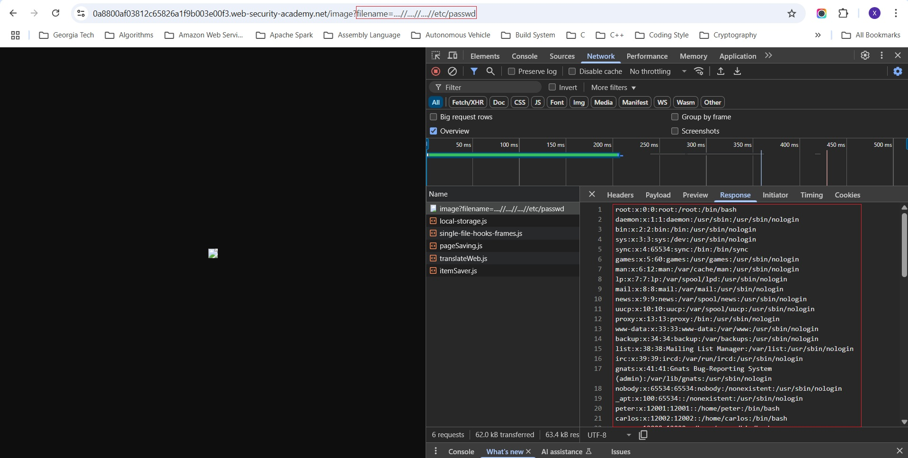
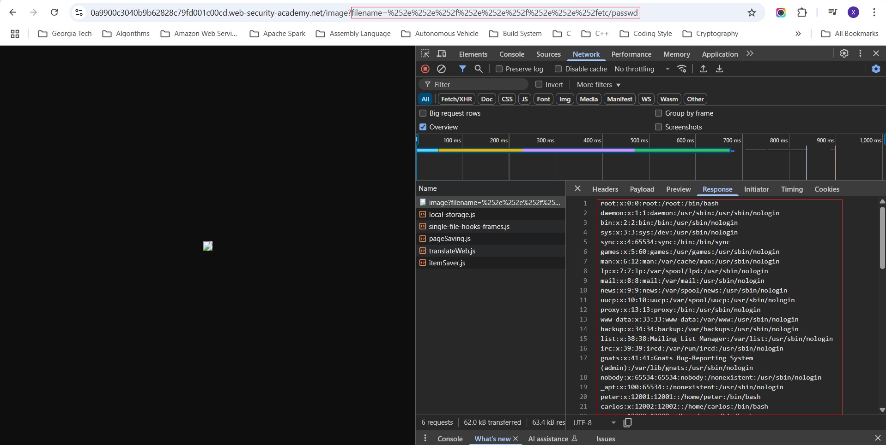

**Lab: File path traversal, simple case**

This lab contains a path traversal vulnerability in the display of product images. To solve the lab, retrieve the contents of the ```/etc/passwd``` file.

**Writeup**: Locate a product image URL, such as ```https://0a7c0068040c818083970aa0005e0089.web-security-academy.net/image?filename=20.jpg```. Use a proxy to intercept the request, modify ```filename=20.jpg``` to ```filename=../../../etc/passwd```, and forward the request. The contents of the password file should appear in the response.


---

**Lab: File path traversal, traversal sequences blocked with absolute path bypass**

This lab contains a path traversal vulnerability in the display of product images. The application blocks traversal sequences but treats the supplied filename as being relative to a default working directory. To solve the lab, retrieve the contents of the ```/etc/passwd``` file.

**Writeup**: Locate a product image URL, such as ```https://0a5400740404be3d81472bc700ce0020.web-security-academy.net/image?filename=20.jpg```. Use a proxy to intercept the request, modify ```filename=20.jpg``` to ```filename=/etc/passwd```, and forward the request. The contents of the password file should appear in the response.


---

**Lab: File path traversal, traversal sequences stripped non-recursively**

This lab contains a path traversal vulnerability in the display of product images. The application strips path traversal sequences from the user-supplied filename before using it. To solve the lab, retrieve the contents of the ```/etc/passwd``` file.

**Writeup**: Locate a product image URL, such as ```https://0a5400740404be3d81472bc700ce0020.web-security-academy.net/image?filename=20.jpg```. Use a proxy to intercept the request, modify ```filename=20.jpg``` to ```filename=....//....//....//etc/passwd```, and forward the request. The contents of the password file should appear in the response.



---

**Lab: File path traversal, traversal sequences stripped with superfluous URL-decode**

This lab contains a path traversal vulnerability in the display of product images. The application blocks input containing path traversal sequences. It then performs a URL-decode of the input before using it. To solve the lab, retrieve the contents of the ```/etc/passwd``` file.

**Writeup**: Locate a product image URL, such as ```https://0a5400740404be3d81472bc700ce0020.web-security-academy.net/image?filename=20.jpg```. Use a proxy to intercept the request, modify ```filename=20.jpg``` to ```filename=%252e%252e%252f%252e%252e%252f%252e%252e%252fetc/passwd```, and forward the request. The contents of the password file should appear in the response.



---

**Lab: File path traversal, validation of start of path**

This lab contains a path traversal vulnerability in the display of product images. The application transmits the full file path via a request parameter, and validates that the supplied path starts with the expected folder. To solve the lab, retrieve the contents of the ```/etc/passwd``` file.

**Writeup**: Locate a product image URL, such as ```https://0a5400740404be3d81472bc700ce0020.web-security-academy.net/image?filename=20.jpg```. Use a proxy to intercept the request, modify ```filename=20.jpg``` to ```filename=/var/www/images/../../../etc/passwd```, and forward the request. The contents of the password file should appear in the response.


---

**Lab: File path traversal, validation of file extension with null byte bypass**

This lab contains a path traversal vulnerability in the display of product images. The application validates that the supplied filename ends with the expected file extension. To solve the lab, retrieve the contents of the ```/etc/passwd``` file.

**Writeup**: Locate a product image URL, such as ```https://0a5400740404be3d81472bc700ce0020.web-security-academy.net/image?filename=20.jpg```. Use a proxy to intercept the request, modify ```filename=20.jpg``` to ```filename=../../../etc/passwd%00.png```, and forward the request. The contents of the password file should appear in the response.


---